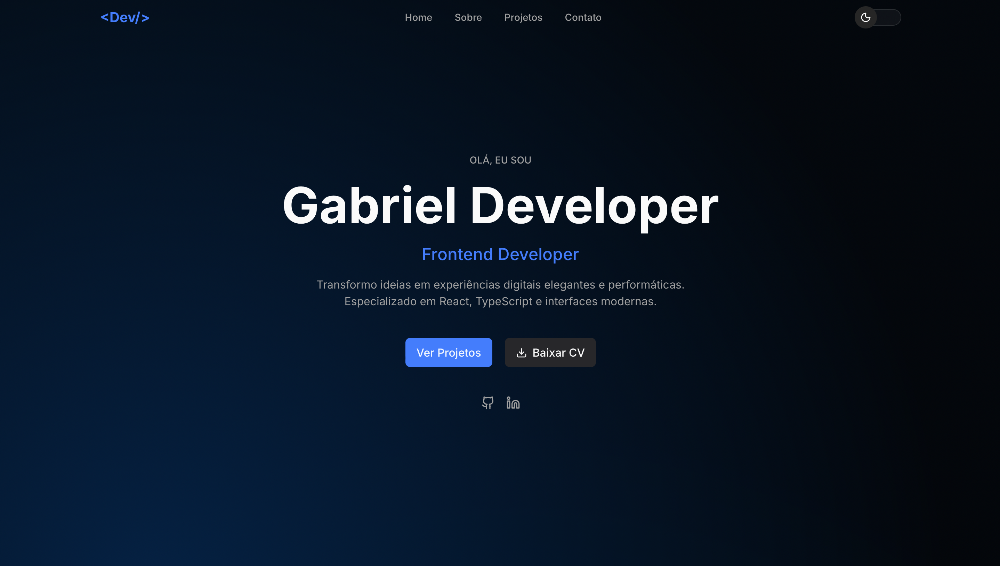

# [Portfolio(Link)](https://portfolio-2-0-lemon-six.vercel.app)

Esse repositório é onde eu hospedo o código do meu portfólio pessoal.
Aqui eu junto meus projetos, experiências e testes que mostram como eu penso e como eu desenvolvo. A ideia não é só mostrar o que eu já fiz, mas também deixar claro como eu estruturo código, organizo ideias e construo interfaces.
O projeto foi feito com foco em simplicidade, performance e clareza. Nada exagerado — só o que realmente importa.
Se você quiser ver como eu organizo um projeto do zero, como separo componentes e como penso arquitetura, é basicamente isso aqui.

## 🎨 Layout

O design da aplicação foi criado no Figma. Durante o desenvolvimento, realizei algumas alterações em relação ao layout original para aprimorar a experiência e a coerência visual, mantendo a proposta principal do projeto:

<a href="https://www.figma.com/design/ZoKBipHMw9siEKhr9ag20g/Untitled?node-id=0-1&p=f&t=Arxm9FXLwLTnJjJR-0">
  
</a>

## 🚀 Começando

Estas instruções permitirão que você obtenha uma cópia do projeto funcionando em sua máquina para desenvolvimento e testes.

## 🔧 Instalação

### Pré-requisitos

Antes de começar, você precisará ter a seguinte ferramenta instalada em sua máquina:
[VSCode](https://code.visualstudio.com/)

Dentro do terminal do VSCode, escreva o seguinte código:

```
git init
```

```
git clone https://github.com/Gabrielingnau/site-blog.git
```

Instale as depêndecias com:

```
npm install
```

Depois é só rodar o projeto com:

```
npm run dev
```

## 🛠️ Tecnologias

- [Next.js](https://nextjs.org) - Biblioteca para interfaces de usuário
- [ShadcnUi](https://ui.shadcn.com) - Um conjunto de componentes lindamente projetados
- [Tailwindcss](https://tailwindcss.com) - Uma estrutura CSS de utilidade-first com classes
- [Typescript](https://www.typescriptlang.org/) - Sintaxe para tipos
- [Prismic](https://prismic.io) - CMS headless com conteúdo via API.

---

# ⌨️ com ❤️ por [Gabriel Lingnau](https://www.linkedin.com/in/gabriel-lingnau-3bb17b266/)

=======
